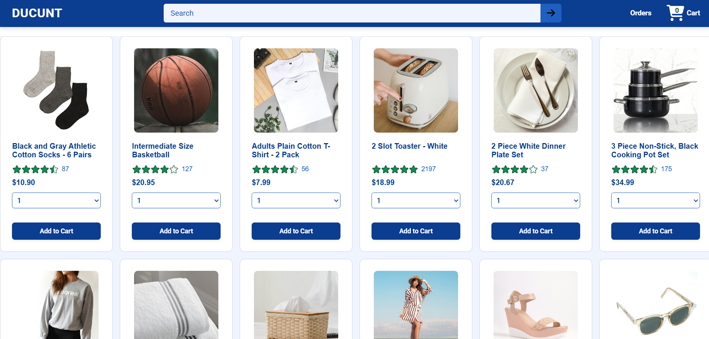
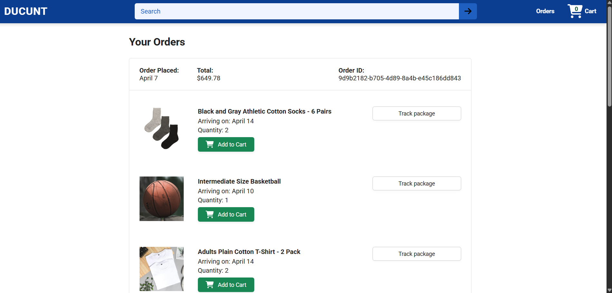
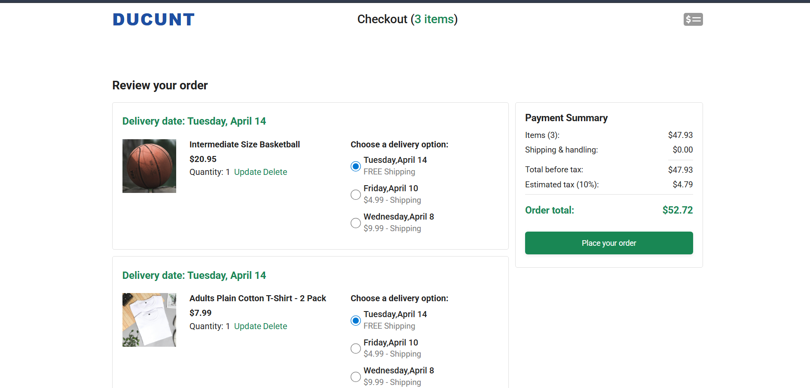

# E-Commerce Web Application

A full-stack e-commerce web application built with React for the frontend and Node.js/Express for the backend. This project demonstrates a complete online shopping experience including product browsing, cart management, checkout, and order tracking.

## Screenshots

### 1. Home Page

The main product catalog page where users can browse available products, view ratings and prices, and add items to their cart.

### 2. Orders Page

The orders page displays the user's order history with details including order date, total cost, and individual products.

### 3. Cart/Checkout Page

The checkout page shows cart items with delivery options, payment summary, and the ability to place orders.

## Features

- **Product Catalog**: Browse products with images, ratings, and prices
- **Shopping Cart**: Add/remove items, update quantities, select delivery options
- **Checkout Process**: Review order, calculate totals with tax and shipping
- **Order Management**: View order history and details
- **Responsive Design**: Works on desktop and mobile devices
- **RESTful API**: Backend provides endpoints for products, cart, orders, and delivery options

## Technologies Used

### Frontend
- **React 19** - Modern JavaScript library for building user interfaces
- **Vite** - Fast build tool and development server
- **React Router** - Client-side routing
- **Axios** - HTTP client for API calls
- **Day.js** - Date manipulation library
- **Vitest** - Unit testing framework
- **Testing Library** - React testing utilities

### Backend
- **Node.js** - JavaScript runtime
- **Express.js** - Web application framework
- **Sequelize** - ORM for database management
- **MySQL2** - MySQL database driver
- **PostgreSQL** - Alternative database support
- **SQL.js** - SQLite in-memory database
- **CORS** - Cross-origin resource sharing

## Installation and Setup

### Prerequisites
- Node.js (v16 or higher)
- npm or yarn

### Backend Setup
1. Navigate to the backend directory:
   ```bash
   cd website-backend
   ```

2. Install dependencies:
   ```bash
   npm install
   ```

3. Start the backend server:
   ```bash
   npm run dev
   ```
   The server will run on `http://localhost:3000`

### Frontend Setup
1. Navigate to the frontend directory:
   ```bash
   cd WebSite
   ```

2. Install dependencies:
   ```bash
   npm install
   ```

3. Start the development server:
   ```bash
   npm run dev
   ```
   The application will be available at `http://localhost:5173`

## Project Structure

```
WebSite/                 # Frontend React application
├── src/
│   ├── components/      # Reusable UI components
│   ├── pages/          # Page components (Home, Checkout, Orders)
│   ├── utils/          # Utility functions
│   └── assets/         # Static assets
├── public/             # Public static files
└── package.json

website-backend/        # Backend Node.js application
├── models/             # Database models
├── routes/             # API route handlers
├── backend/            # JSON data files
├── defaultData/        # Default data for reset
└── server.js           # Main server file
```

## API Endpoints

- `GET /api/products` - Get all products
- `GET /api/cart-items` - Get cart items
- `POST /api/cart-items` - Add item to cart
- `PUT /api/cart-items/:id` - Update cart item
- `DELETE /api/cart-items/:id` - Remove item from cart
- `GET /api/delivery-options` - Get delivery options
- `GET /api/payment-summary` - Get payment summary
- `POST /api/orders` - Create new order
- `GET /api/orders` - Get user orders


## Testing

Run tests for the frontend:
```bash
cd WebSite
npm test
```

## Building for Production

Build the frontend for production:
```bash
cd WebSite
npm run build
```

## Contributing

This project was built as part of a learning exercise. Feel free to fork and modify for your own use.

## License

This project is for educational purposes and portfolio use.
